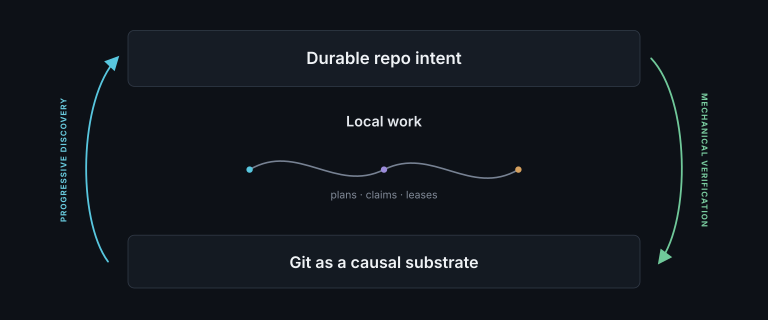

# git-intent: Intent layer for Agentic Work

git-intent uses Git's own mechanics to keep accepted architectural meaning durable, active coordination disposable, and both progressively informed by the repository itself.



## Repository memory

Start sparse. As work reveals a stable responsibility, a relied-on boundary, or a design limit that
future changes must respect, git-intent surfaces it for acceptance. Only that accepted meaning is
tracked with the code. Promises that can be tested name executable checks; judgments that cannot be
reduced to a command remain explicit review questions. The model grows from evidence instead of
requiring an upfront architecture inventory.

## Working coordination

Plans, claims, and leases are ignored local state for the work in flight. They help agents divide,
sequence, and safely converge branch work, then may disappear after landing. Git ancestry, tree
identity, scoped checks, and atomic ref updates provide the hard guarantees without turning active
planning into permanent repository meaning. The complete model is documented in [SPEC.md](SPEC.md).

## Install

```bash
npx skills add RenderBear/git-intent --all
```

Copy the fenced block from [AGENTS.example.md](AGENTS.example.md) into the repository's
always-loaded agent instructions.

## Skills

| Skill | Responsibility |
|---|---|
| `intent-brief` | Select semantic domains and compile applicable governance and live claims. |
| `intent-coordinate` | Validate parallel plans and manage causal leases. |
| `intent-audit` | Discover and persist non-authoritative findings. |
| `intent-record` | Adopt accepted domains, contracts, constraints, and defining material. |
| `intent-land` | Review and verify a prospective tree, then atomically converge it. |

## Configuration

Configuration is optional:

```yaml
version: 1
resolution: assisted
integration_branch: main
```

`resolution` controls who resolves consequential architectural ambiguity:

| Mode | Behavior |
|---|---|
| `assisted` | The agent handles routine work within recorded intent, but asks the user before resolving an ambiguous architectural change, compatibility promise, or consequential side effect. |
| `auto` | The agent may resolve those questions itself when the current request and recorded authority provide enough evidence. It still reports the resolution and records durable consequences when needed. |

Both modes enforce recorded contracts and constraints. Neither mode grants permission to contradict
explicit requirements or perform external actions such as pushing, deploying, publishing, or
destructive cleanup.

`integration_branch` optionally fixes the local convergence target. Without it, git-intent captures
the current branch when work begins.

## Repository state

```text
.intent/config.yml             optional resolution and integration target
.intent/DOMAINS.yml            accepted semantic responsibilities
.intent/CONTRACTS.yml          accepted cross-domain promises
.intent/CONSTRAINTS.yml        accepted architectural constraints
.intent/audits/<id>.yml        tracked non-authoritative audit evidence
.intent/observations/<id>.yml  tracked non-authoritative facts
.intent/runtime/plans/         ignored active coordination graphs
.intent/runtime/leases/        ignored live ownership claims
```

Runtime is shared by linked worktrees through the primary worktree. It may be removed without
changing repository meaning, although doing so discards active coordination state.
